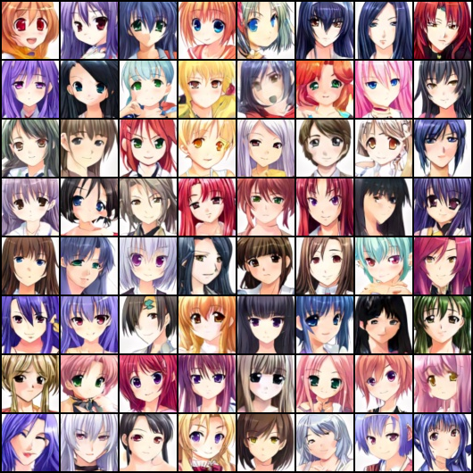
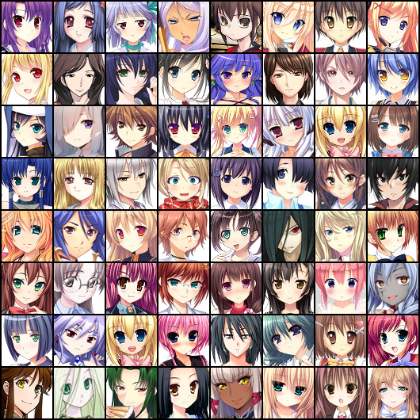

# DCGAN Anime Generation
- Tried out vanilla GAN and LSGAN for anime generation using DCGAN structure.
- Collected our own dataset (scraped images from a online manga store)

## Training process
- Used original DCGAN paper settings.
- Halved the discriminator loss to balance G/D gradient descent schedule.
- Used soft-labeling (0.8/0.9 ~ 1)

## Results
||Given dataset|Our own dataset|
|--|-------------|---------------|
|Real Distribution|||
|GAN|||
|LSGAN|||
|WGAN|||

## Problems
- Our own dataset has some outliers (darker skin tone).